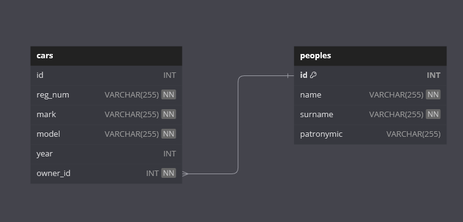

# Car Management API

## Технологии
- **Go** - язык программирования
- **Gorilla Mux** - HTTP роутер и диспетчер для Go
- **PostgreSQL** - система управления базами данных
- **Docker** - для контейнеризации и упрощения развертывания

## База данных



Для просмотра SQL запросов рекомендуем ознакомиться с [файлом](internal/database/queries.go).

## Установка и запуск

### Предварительные требования
- Установленные Docker и Docker Compose
- Go версии 1.20 или выше

### Конфигурация

Перед запуском необходимо отредактировать файлы конфигурации для корректной работы приложения:

1. Файл [.env](docs/.env)

    Этот файл содержит переменные окружения, используемые приложением для настройки его параметров.

2. Файл [docker-compose.yml](docker-compose.yml)

   Этот файл используется для определения и запуска многоконтейнерных Docker приложений.

### Шаги для запуска
```bash
    git clone https://github.com/likimiad/car-management-api.git
    cd car-management-api
    make docker-build
```

Для более подробной информации по работе Makefile'a рекомендуем вызвать команду `make help` или посмотреть [сам файл](Makefile).

## Использование API

### Эндпоинты

```
    GET   /api/cars       - получение информации о всех машинах, поддерживает фильтрацию по всем полям
    GET   /api/cars/{2}   - получение информации о машине по идентификатору 
    POST /api/cars        - добавление новых автомобилей
    DELETE /api/cars/{id} - удаление автомобиля по ID
    PUT /api/cars/{id}    - обновление информации об автомобиле
```

Для получения более подробной информации о взаимодействии с API воспользуйтесь директорией `/docs/`, где доступен Swagger UI с полной документацией и возможностью тестирования API.

## Дополнительная информация

Для симуляции Third Party API использовался [**FastAPI**](test/third_party_api), он не имеет подключение к базе данных, а просто [генерирует информацию](test/third_party_api/models.py) при помощи библиотеки **Faker**. При запуске docker'a запускается контейнер с **FastAPI**.